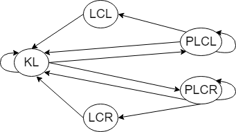

# CarND-Path-Planning-Project
Self-Driving Car Engineer Nanodegree Program

### Project Requirements
In this project your goal is to safely navigate around a virtual highway with other traffic that is driving +-10 MPH of the 50 MPH speed limit. You will be provided the car's localization and sensor fusion data, there is also a sparse map list of waypoints around the highway. The car should try to go as close as possible to the 50 MPH speed limit, which means passing slower traffic when possible, note that other cars will try to change lanes too. The car should avoid hitting other cars at all cost as well as driving inside of the marked road lanes at all times, unless going from one lane to another. The car should be able to make one complete loop around the 6946m highway. Since the car is trying to go 50 MPH, it should take a little over 5 minutes to complete 1 loop. Also the car should not experience total acceleration over 10 m/s^2 and jerk that is greater than 10 m/s^3.

### Program Design
Most of the logic are in the `car.h`, where an `ego` Car object is used to represent the car. The most important information carried across cycles is the car's state and target_lane. The state is a string in {"KL", "PLCL", "PLCR", "LCL", "LCR"}, and the target_lane is used to check whether the car has finished lane transition.

##### States
The behavior for each state is defined as:
* **"KL"**: try to keep in the current (target) lane and drive at the maximum speed allowed for the current lane, or target_lane if in lane transition.
* **"PLCL"** or **"PLCR"**: keep driving in the current lane, and limit the speed to a value proper for both the current and also the lane on the left for PLCL and the lane on the right for PLCR.
* **"LCL"** or **"LCR"**: change to the lane on the left or right, and aim at the speed of the target_lane (assuming that we only change lane when we can drive at a faster speed). For simplicity, here I assumed that the car can only have one cycle with lane_change state, then immediately transit to KL state, but the target_lane will be the new lane after change, regardless of the current lane. The car has to stay in the KL state until it almost reaches the center of the target_lane.

The state transition graph is therefore:

Note that the car cannot stay at LCL or LCR states. And when it reaches KL from LCL or LCR, it is free to consider another lane change only if it has been within 0.2 of the target_lane center (to confirm lane_change has finished).

##### Path generation
At each cycle, the program invokes `generate_path()` to do the following steps:
1. `update_car()`: Update information of its own, including the position, speed, lane, yaw. Since only the current car state is carried across cycles, it is better to not rely on the path generated too many cycles ago. So only 10 points from the previous cycles are kept. The end point of the cached path will be used as the starting point of new trajectories.
2. `update_lane_vel()`: Update the maximum speed we can drive at each lane using sensor_fusion data of other cars. For the lane we are driving, this only considers cars already in front of us. For other lanes, this considers cars in front of us now or at the end of cached path, so cars passing us are also included.
To avoid following the front car too close, the target speed would be slightly slower than the car closely in front.
To reduce noise in car speed reading and cars momentarily disappeared in the sensor_fusion list, the updated speed for each lane is defined as `0.98 * prev_speed + 0.02 * new_speed`.
3. `get_next_states()`: Get a list of possible next states based on current car state.
4. `generate_trajectory()`: Generate the possible trajectory for each next state.
Here the position target is to reach the lane center of next_lane after 30m, and stay in the same lane. The trajectory is generated using spline so it will not violate jerk limit.
The speed target is the max speed to follow front cars in this lane, the acceleration is fixed at 0.1 m/s per cycle to not break the acceleration limit.
5. Calculated the cost for the trajectory of each next state. Pick the one with lowest cost, set that next state as the car's state, and return the trajectory for the selected state. If the state is lane change, also update the target_lane.

##### Cost function
Here I included four components in the cost function.
* Collision cost: the one we try hard to avoid. Since car is a long rectangle, collision is defined by checking the distance in d and distance in s. In d direction, the cost is non-zero only when another car is within the car width, this is so the car will not be afraid to drive along other cars. In s direction, the cost is non-zero for a wide range to reward keeping enough distance, and becomes extremely large when another car is within the tolerance. The total collision cost is defined as the maximum along the trajectory.
* Speed cost: defined as square error from the max speed, averaged along the trajectory.
* Acceleration cost: defined as square error from zero acceleration, averaged along the trajectory.
* Lane change cost: constant reward for considering alternative lanes, but constant punish for actually changing lane. The reward for PLCL and PLCR is tiny, and the punish for actual lane change requires an average speed increase of 3 m/s (15% of max speed) to initialize a lane change.

### Code Structures
The project includes the following files:

* `main.cpp`: the main program to communicate between our car object `ego` and the simulator. It reads simulator data into a json object and invokes `ego.generate_path(j[1])` to get the planed path. All implementations are in the `Car` class defined in `car.h`.
* `car.h`: where most of the logic is defined. This class includes:
  - Important car state information: the car state as a string, and the target_lane to know if car is in lane transition.
  - The `generate_path()` function, which will update car information from the simulator message and return the trajectory with the lowest cost.
* `cost.h`: definition of the cost function. The final cost function is a weighted sum of four parts.
* `helper_functions.h`: a bunch of useful functions for unit conversion, coordinate transformation, etc.

### Rubric points
##### The car is able to drive at least 4.32 miles without incident.
The car could drive for 20 miles without incidents in my test.
##### The car drives according to the speed limit.
The max possible speed used in trajectory generation is within limit.
##### Max Acceleration and Jerk are not Exceeded.
The max acceleration is hardcoded, and jerk is minimized through spline.
##### Car does not have collisions.
By adding a large coefficient to the collision cost.
##### The car stays in its lane, except for the time between changing lanes.
By adding a constant punish for lane change.
##### The car is able to change lanes.
Happens when the reduce in speed cost is larger than the constant lane change cost.

### Other thoughts
##### 1. Errors converting from XY coordinate to Frenet coordinate.
A continuous line in XY coordinate may not translate to a continuous line in Frenet coordinate! Thus coordinate transformation should be used only when it is necessary.
##### 2. Handling noise in the sensor_fusion data.
It turns out the sensor_fusion data is quite noise, especially the car speed. There are cars that randoms changes speed, car that randomly disappears from the sensor_fusion. So it is better to use a slow changing version of the lane speed instead of the most recent reading. A better solution is to cache the sensor_fusion data from previous few cycles and make decisions based on an averaged version.
##### 3. Cars behind.
I am ignoring all cars behind me and in the same lane assuming that they will try to avoid hitting me. This should be valid most of the time.
##### 4. Advanced path planning.
My implementation only keeps the *current* car state and only considers the situation of the next ~1s. So it may stuck at a sub-optimal lane. For example, if we are in the left lane and the lane speed are 18 | 17 | 22, the current implementation will just stay in the left lane. A better implementation would be to have several sparse *planned waypoints*, assign a state for each waypoint, and at each cycle, keep the state of the next one or two waypoints but re-choose for all following waypoints at each cycle. This would help to find the optimal path that requires a short slow down to move to the mid lane but eventually reaches the faster right lane.
